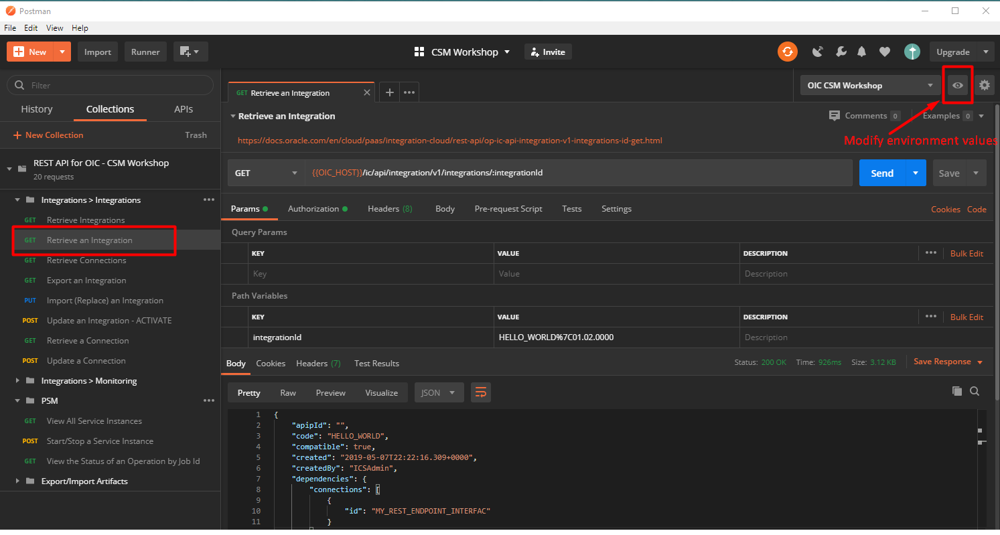

# postman-oic

> **This repo is archived due to old age.**
>
> **Note: Always refer to the latest product documentation.**

---

Postman collection for OIC REST APIs

* Download collection and environment
* Postman > Import
* Modify the Environment and set the values for OIC_HOST, USER_LOGIN and USER_PW. For the PSM requests, set also IDCS_ID.
* Try out the Requests. Tip! Check the description of each request for reference to docs or usage.

Example
---

